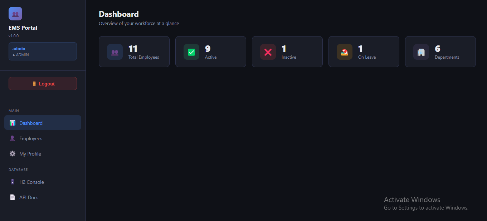
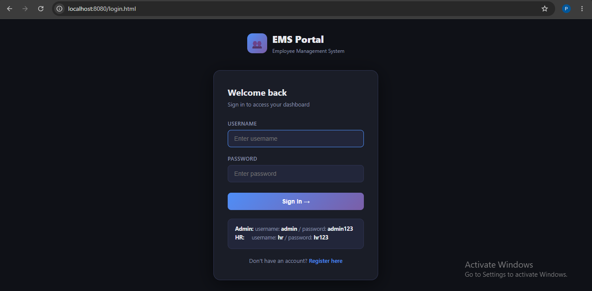
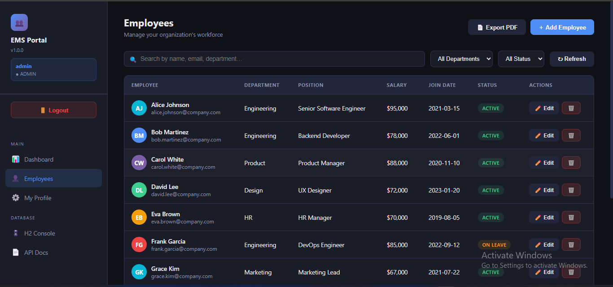
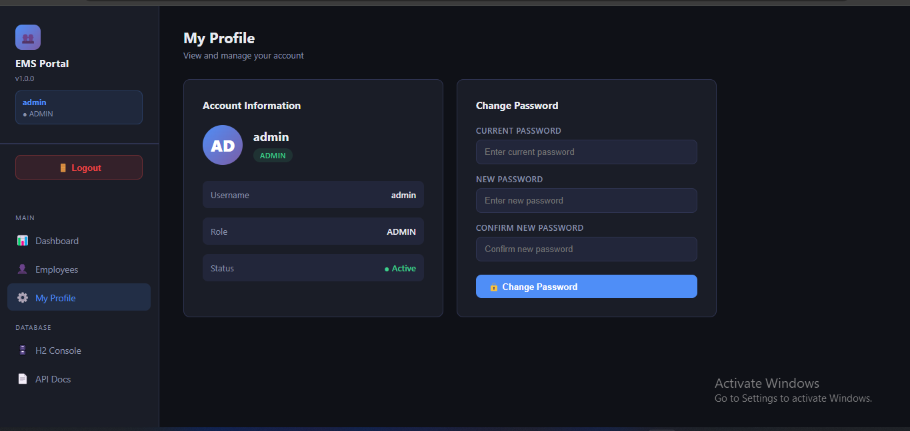

# 🏢 Employee Management System

A full-stack **Employee Management System** built with **Java Spring Boot** and a responsive frontend. A professional portfolio project demonstrating real-world backend architecture, RESTful API design, Spring Security, and clean UI.



---

## 🛠️ Tech Stack

| Layer      | Technology                  |
| ---------- | --------------------------- |
| Language   | Java 17                     |
| Framework  | Spring Boot 3.2             |
| Security   | Spring Security + BCrypt    |
| ORM        | Spring Data JPA / Hibernate |
| Database   | H2 (file-based, persistent) |
| PDF Export | iTextPDF 5.5.13             |
| Email      | Spring Mail (Gmail SMTP)    |
| Build Tool | Maven                       |
| Frontend   | HTML5, CSS3, Vanilla JS     |

---

## ✨ Features

- 🔐 **Login & Registration** — Secure authentication with BCrypt encrypted passwords
- 👥 **Employee CRUD** — Add, edit, delete, and view employees
- 🔍 **Real-time Search** — Search across name, email, department, position
- 📊 **Dashboard Analytics** — Live workforce stats with clickable cards
- 📄 **PDF Export** — Download professional employee report
- 📧 **Email Notifications** — Welcome email sent automatically on employee creation
- 👤 **Profile Page** — View account details and change password
- 🗄️ **Persistent Database** — Data saved across app restarts

---

## 📸 Screenshots

### Login Page



### Dashboard


### Employees



### Profile Page



---

## 🚀 Getting Started

### Prerequisites

- Java 17+
- Maven 3.8+

### Run the Application

```bash
git clone https://github.com/priyags3071/ems-springboot-project.git
cd ems-springboot-project
mvn spring-boot:run
```

Open: **http://localhost:8080**

Default login:

- Username: `admin`
- Password: `admin123`

---

## 📡 REST API Reference

| Method | Endpoint                       | Description             |
| ------ | ------------------------------ | ----------------------- |
| GET    | `/api/employees`               | Get all employees       |
| GET    | `/api/employees/{id}`          | Get employee by ID      |
| POST   | `/api/employees`               | Create employee         |
| PUT    | `/api/employees/{id}`          | Update employee         |
| DELETE | `/api/employees/{id}`          | Delete employee         |
| GET    | `/api/employees/stats`         | Dashboard statistics    |
| GET    | `/api/employees/export/pdf`    | Export PDF report       |
| GET    | `/api/profile`                 | Get logged-in user info |
| POST   | `/api/profile/change-password` | Change password         |

---

## 🏗️ Architecture

Frontend (HTML/CSS/JS)
↕ REST API (JSON)
EmployeeController ← HTTP handling, validation
↕
EmployeeService ← Business logic, transactions
↕
EmployeeRepository ← Spring Data JPA
↕
H2 File Database

---

## 👤 Author

**Priya GS**

- GitHub: [@priyags3071](https://github.com/priyags3071)
